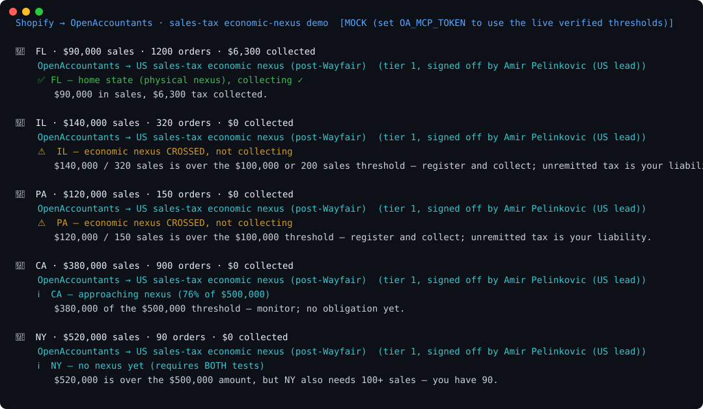

# Shopify → OpenAccountants: sales-tax economic-nexus demo

**The pitch in one line:** Shopify takes the orders. OpenAccountants tells you **which states you now owe sales tax in** — the post-Wayfair economic-nexus lines you cross silently — signed off by a named licensed accountant.

```
Shopify sales by state
  └─ { state, period_sales, orders, tax_collected }
        └─ OpenAccountants MCP  →  load the verified nexus thresholds
              └─ Verdict:  ⚠️ nexus CROSSED, not collecting — register now   ← the catch
                           ℹ️  approaching the threshold — monitor
                           ℹ️  no nexus yet (some states need BOTH $ and count)
                           ✅ home state / collecting where required
                 · per-state threshold cited
                 · the named CPA who signed off the rules
```



> Regenerate the visual: `python make_svg.py` (static SVG, no deps) · animated GIF: `brew install vhs && vhs demo.tape`

## Why this one

Since *South Dakota v. Wayfair* (2018), you owe sales tax in a state once your sales there cross an **economic-nexus threshold** — often **$100k or 200 transactions** — with **zero physical presence**. Cross it and not collect, and the unremitted tax becomes *your* liability, with penalties. It's the single biggest silent risk for any growing Shopify store, and nothing in the order flow warns you.

- **Shopify = the orders and the totals.**
- **OpenAccountants = the obligation.** Per-state thresholds, the AND/OR logic, physical vs economic nexus — verified, and signed off by a real accountant.

## What it shows

A store's sales by state, run through the OpenAccountants MCP:

| State | Verdict |
|---|---|
| FL (home) | ✅ Physical nexus — collecting |
| **IL — $140k / 320 orders** | ⚠️ **Nexus crossed, collecting $0** |
| **PA — $120k** | ⚠️ **Nexus crossed, collecting $0** |
| CA — $380k | ℹ️ Approaching ($500k threshold) — monitor |
| NY — $520k / 90 orders | ℹ️ No nexus yet — NY needs **both** $500k *and* 100 sales |

**The money shots:** IL and PA — over the threshold and **collecting nothing**. And the NY nuance shows the depth: $520k is over the dollar test, but NY requires **both** $500k *and* 100+ transactions, so there's no obligation at 90 sales. That AND/OR distinction is exactly the kind of thing stores get wrong.

## Run it

```bash
git clone https://github.com/openaccountants/shopify-salestax-demo
cd shopify-salestax-demo
python pipeline.py                       # bundled sample (mock mode, no keys)
python pipeline.py samples/sales_by_state.json
```

### Go live

```bash
export OA_MCP_TOKEN=...     # OpenAccountants account token (uses the live verified thresholds)
python pipeline.py
```

## Files

| File | Role |
|------|------|
| `pipeline.py` | Orchestrator + CLI: sales-by-state → OA → verdict report |
| `shopify_client.py` | Normalizes Shopify sales-by-state totals |
| `oa_client.py` | OpenAccountants MCP JSON-RPC client (live or mock) |
| `nexus_check.py` | Tests each state against its nexus threshold → verdict |
| `samples/sales_by_state.json` | A store's sales by state |

## Honest notes

- `nexus_check.py` is a **registration/economic-nexus signal only** — not marketplace-facilitator carve-outs, product taxability, local district rates, or the exact tax due. Production leans on the full OA skill + an agent step; the named-CPA sign-off makes the verdict relianceable.
- Thresholds (CA/TX $500k, NY $500k AND 100, IL $100k from 1 January 2026, PA/FL $100k) are real post-Wayfair figures; live, every value comes from `get_skill`. The verifier (Amir Pelinkovic) is the real OpenAccountants US lead.

The Illinois sample uses the rule effective 1 January 2026: $100,000 or more of qualifying gross receipts, without the former 200-transaction test. Its period totals must cover the applicable preceding 12-month measurement window, evaluated quarterly. Do not use this rule for a historical pre-2026 assessment. Physical presence and existing collection obligations require separate consideration. Source: [Illinois bulletin FY 2026-12](https://tax.illinois.gov/research/publications/bulletins/fy-2026-12.html).

Run the offline checks with `python -m unittest discover -s tests -v`.
